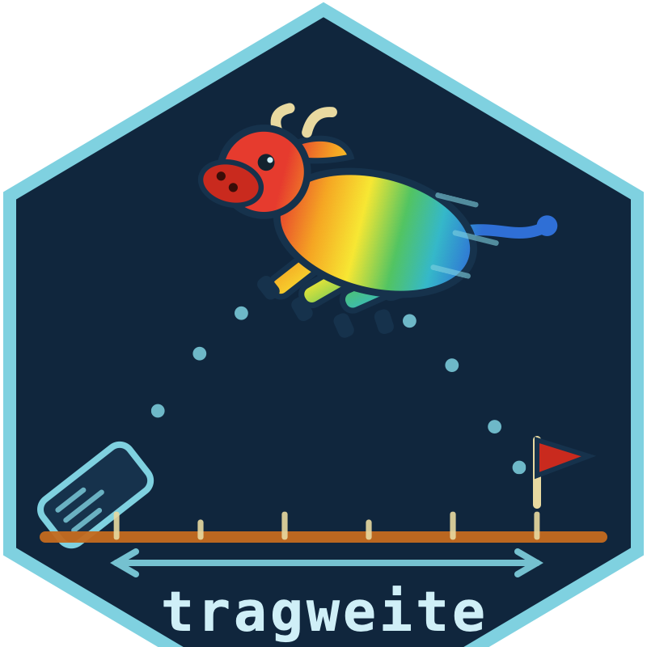

# tragweite 

[](https://github.com/chrisobeser/tragweite/actions)
[](LICENSE)
[](#status)

**A study's design decides, before the first patient enrolls, which
effects it can ever detect. tragweite computes that decision:
simulation-based design planning for precision psychotherapy
studies.**

Every precision psychotherapy study places a bet at the design stage:
that thirty therapists at caseload eight, with outcomes at session six
and an intraclass correlation near .10, can detect the effect the
study is looking for. For average effects in unnested designs,
closed-form power formulas check this bet. For the questions the field
actually asks (does the treatment work better for some patients than
for others? do particular patients do better with particular
therapists?) no formula exists: detection depends on the interplay of
nesting, caseload, session structure, measurement, and estimator.
tragweite checks the bet the only way it can be checked. It rebuilds
the planned study inside simulated clinics where the true effect size
is set by construction, runs the planned analysis, and counts how
often the effect is found.

Skipping the check has documented costs. A scoping review of
therapist-effect research found hardly any primary study designed or
powered for effects on the therapist side (Alfonsson et al., 2026,
*Psychotherapy Research*). A null finding from such a design reads as
a fact about therapy; often it is a fact about the design.

*Tragweite* is German for reach: how far does a design carry?

## What you can do with it

**Ask about one design.** `tragweite()` simulates the study you are
about to run and reports what it could see:

``` r
library(tragweite)
tragweite("matching", tau = .3, tau_x = .2, tau_c = .2, tau_xc = .35,
          n_therapists = 20, caseload = 10, reps = 200, seed = 42)
#> tragweite -- detection probability of the design
#>   Effect sought : matching (tau = 0.3, tau_x = 0.2, tau_c = 0.2, tau_xc = 0.35)
#>   Design        : 20 therapists x caseload 10 (N = 200), 4 sessions, ICC 0.10, patient-level assignment
#>   Criterion     : Satterthwaite test of the z:x:c triple interaction (mixed model; parametric baseline criterion)
#>   Power         : 0.520 [MCSE 0.035] (104/200 worlds; 0 failed fits)
#>   Verdict       : below the 80% convention -- a real effect of this size would usually be missed.
```

Every report names the design, the detection criterion, and the
number of failed fits, and power always carries its Monte Carlo
standard error.

**Compare designs fairly.** `design_grid()` sweeps therapists,
caseload, ICC, and sessions under common random numbers: competing
cells face identical simulated worlds, so a power difference between
two designs is a design difference, not resampling noise.
`min_design()` walks the same grid and returns the smallest design
that reaches a target power.

**Anchor effect sizes instead of guessing them.** A power analysis is
only as good as the effect size it assumes. `scenario()` ships
anchors from the published literature with their sources attached,
and refuses to translate where no defensible translation exists:

``` r
scenario("personalization_floor")
#> Scenario 'personalization_floor'
#>   Anchor : d = 0.14 [0.08, 0.20], risk-of-bias-adjusted
#>   Source : Nye, Delgadillo & Barkham (2023), J Consult Clin Psychol, doi:10.1037/ccp0000820
#>   Note   : Strategy-level ATE of personalized vs. standardized care -- NOT a moderation
#>            amplitude. No defensible automatic mapping to tau_x exists yet; use as a
#>            sensitivity anchor and report the assumption you choose.
#>   Ready-to-use args: none (see note) -- anchor only.
```

The refusal is a feature. A strategy-level *d* is not a moderation
amplitude, and a tool that silently converted one into the other
would manufacture precision it does not have.

## How it relates to windkanal

[windkanal](https://github.com/chrisobeser/windkanal) answers the
question that comes before this one: which estimator can be trusted,
under which conditions. tragweite holds a validated estimator fixed
and varies the design. The two share one engine (windkanal is the
simulation core and a hard dependency) and split one workflow:
windkanal decides whether to trust the tool, tragweite decides
whether to run the study.

Neighboring tools solve neighboring problems. simr simulates power
for mixed-model fixed effects; longpower collects closed-form
formulas for longitudinal group contrasts; Luedtke, Sadikova, and
Kessler (2019) plan sample sizes for treatment-selection benefits in
unnested designs. None of them covers heterogeneity and matching
effects under therapist nesting with the estimator in the loop. That
open cell is what tragweite is for.

## Beyond psychotherapy

Nothing in the machinery is specific to psychotherapy. The same
design problem (few providers, small caseloads, outcomes nested in
the people who deliver the treatment, effects that may vary by
patient, provider, or pairing) appears wherever humans deliver an
intervention, from education to medical care. The calibrated
scenarios and presets are psychotherapy-specific; the design
mathematics is not, and users from neighboring fields can bring
their own parameters.

## Design principles

- `seed` is a mandatory argument. A planning claim that cannot be
  reproduced is an anecdote.
- Grid comparisons run on common random numbers, so design effects
  are never confounded with simulation noise.
- Every scenario anchor carries a source and an estimand note.
  Missing translations are stated, not invented.
- Every report names its detection criterion, so no power number
  floats free of the test that produced it.

## Status

**Early development version.** The v0 core works and is tested:
`tragweite()`, `design_grid()`, `min_design()`, and the `scenario()`
registry, with unit tests and continuous integration from the first
commit. Detection criteria are parametric so far (Satterthwaite tests
of the treatment, interaction, and triple-interaction coefficients);
estimator-based criteria follow as their decision rules pass
validation in windkanal. The pipeline is cross-checked against the
audited windkanal validation run: with identical seeds it reproduces
the reference power exactly (0.6300, all 300 world-level decisions
identical), and fresh-seed replications agreed within two Monte Carlo
standard errors in five of six checks (`validation/cross_check_v0.R`).
Interfaces may still change.

## Roadmap

Three pillars make this its own package rather than a wrapper:

1. **Estimand translation.** Published effect sizes (strategy ATEs,
   allocation contrasts, slope differences) are not data-generating
   parameters. The translation layer turns each anchor into a
   derivation with stated assumptions, or says that none is
   defensible; `scenario()` already enforces the honest half of that
   contract.
2. **Design economics.** `min_design(budget = ...)`: the cheapest
   design that reaches target power given per-therapist, per-patient,
   and per-wave costs, and which design lever buys the most power per
   euro.
3. **Retrospective design diagnosis.** `ceiling()`: given the
   structure of an existing dataset, which effects could it ever have
   detected? This turns published null findings into testable claims
   about designs, separating "the effect is absent" from "the design
   could not have seen it".

Nearer term, in rough order:

- [x] v0 core: `tragweite()`, `design_grid()` (common random
      numbers), `min_design()`, anchored `scenario()` registry,
      Satterthwaite detection criteria
- [ ] `ceiling()`: retrospective design diagnosis (next)
- [ ] Design dimensions that formulas never had: informative dropout,
      measurement reliability, realistic caseload distributions,
      recruitment timelines
- [ ] Estimator-based detection criteria, added as their decision
      rules pass validation in windkanal
- [ ] Preregistration report generator: power text with seeds,
      versions, and criteria, ready to paste
- [ ] Shiny design explorer
- [ ] CRAN submission once the interfaces have settled

## Citation

``` r
citation("tragweite")
```

Obeser, C. (2026). *tragweite: Simulation-based design planning for
precision psychotherapy* (R package, development version).
https://github.com/chrisobeser/tragweite

## License

MIT. Contributions are welcome, see `CONTRIBUTING.md`.
